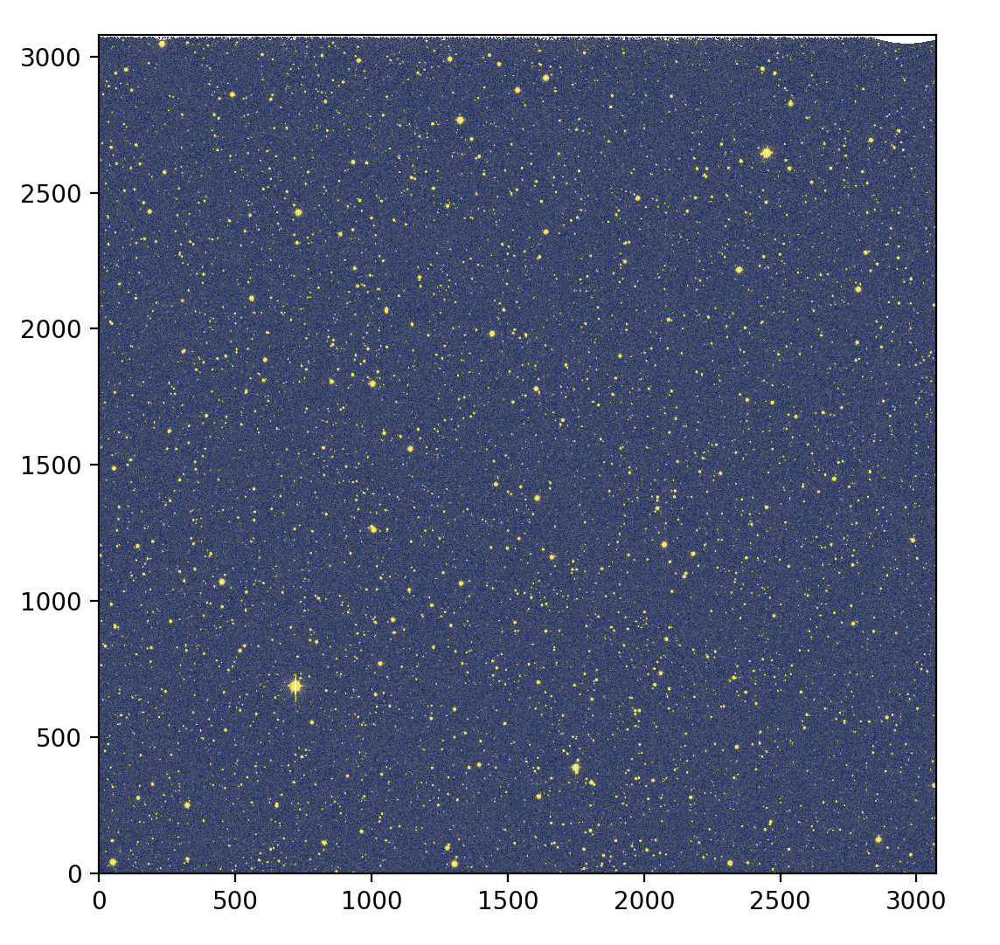
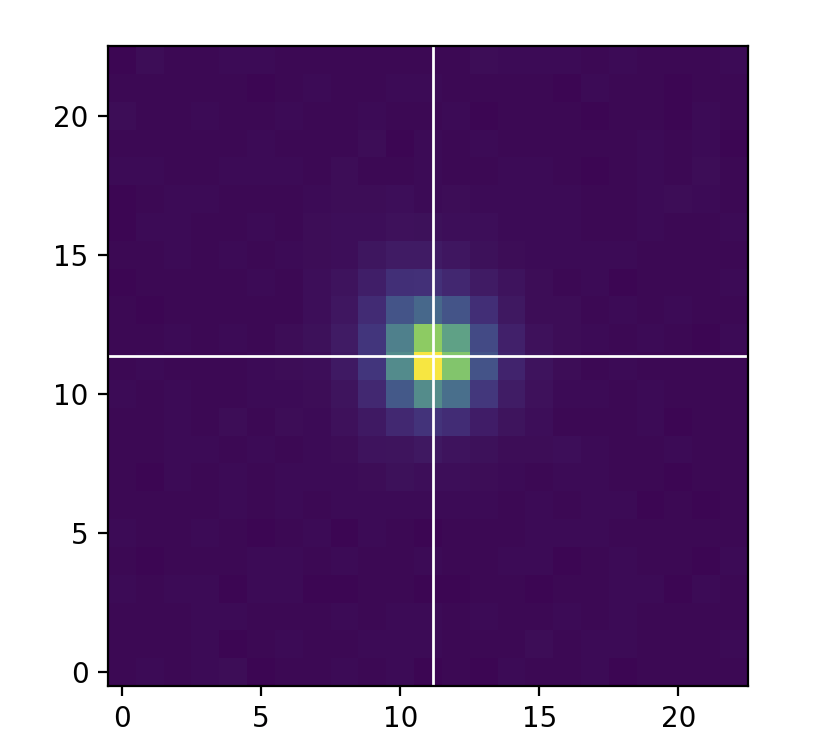

# ztfimg
ZTF Images tools 

# Installation

[](https://pypi.python.org/pypi/ztfimg)
[](https://ztfimg.readthedocs.io/en/latest/?badge=latest)

or git:
```
git clone https://github.com/MickaelRigault/ztfimg.git
cd ztfim
pyton setup.py install
```

#### Dependencies

- This package uses `sep` for source extraction, background estimation and aperture photometry. [sep](https://sep.readthedocs.io/en/v1.0.x/api/sep.extract.html) is a python version of sextractor.  
- This packages uses ztfquery for accessing ztf image product. [ztfquery](https://github.com/MickaelRigault/ztfquery)

***
# Read the doc:
It is here: https://ztfimg.readthedocs.io/en/latest/

***
# Tutorials

Please have look to the existing tutorials
- [Aperture Photometry](tutorials/tutorial__AperturePhotometry.ipynb) | single and multiple images, with or without Dask.
- [Raw Image Manipulation](tutorials/tutorial_RawImages_and_Merges.ipynb) | Raw Quadrant, CCD, Focal plane, with and without Dask & CCDCollection (and robust mean)

***
# quick start

Say you have a sciimg and its associated mask:
```python
sciimg = "ztf_20200204197199_000812_zr_c04_o_q3_sciimg.fits"
mask = "ztf_20200204197199_000812_zr_c04_o_q3_mskimg.fits"
```
then:
```python
from ztfimg import science
z = science.ScienceImage(sciimg, mask)
z.show('dataclean')
```

<p align="left">
  
</p>


## Alternative loading, `from_filename()`
If you don't know the exact path of the ztf file (or if you never downloaded it), use the `from_filename()` class method to instanciate the image. It will look for the file and download it if necessary. See `ztfquery` for details on how this works. The sciimg only is necessary, it will look itself for the corresponding mskimg. However, you can still force the use of another mskimg (though you should not).

```python
from ztfimg import science
z = science.ScienceImage.from_filename(sciimg)
z.show('dataclean')
```

## Data
ZTFImages hold three data attributes:
- `self.data`: the image data as loaded
- `self.datamasked`: the image data as loaded by masked for bad pixel values (see `self.get_mask()`)
- `self.dataclean`: masked images background subtracted (see `self.get_background()`)

In addition you have:
- `self.mask`: the bitmask data as loaded
- `self.background`: the default background image constructed (see `self.set_background()` and `self.load_source_background()`

**Note**: the ztf mask has by default the following arguments
```python
z.get_mask( tracks=True, ghosts=True, spillage=True, spikes=True,
            dead=True, nan=True, saturated=True, brightstarhalo=True,
            lowresponsivity=True, highresponsivity=True, noisy=True,
            sexsources=False, psfsources=False)
```

The `z.get_data()` method provides generic access to any of these attributes (data/mask/background).


## Astrometry
`ztfimg` uses `astropy.wcs` for loading the WCS solution given the image's header. We use the following definitions:
- `xy`: image pixel coordinates
- `radec`: world system RA, Dec coordinates (in degree)
- `uv`: tangent plane coordinates (in arcsec)

(`uv` needs `pointing` correcly set. Change the header pointing key if neccesary `self.load_wcs(header, pointingkey=["RA","DEC")` )

Object holder wcs solutions have the system conversion methods, e.g. `xy_to_radec`, `uv_to_radec`, `xy_to_uv`


## Flux / Counts / Mags

- `counts`: values from the images
- `flux`: flux (erg/s/cm2/A) using the `magzp` from the header and assuming the effective filter wavelength (see `self.filter_lbda`)
- `mag`: magnitude (ab) using the `magzp` from the header  and assuming the effective filter wavelength (see `self.filter_lbda`)

Images have the convertion methods, e.g. `counts_to_mag`, `flux_to_counts` or `mag_to_flux`.


***
# Source Extraction 

You can run `sep.extract` to extract ellipses à la sextractor. Run:
```python
z.extract_sources(data="dataclean", setmag=True)
```

Access the results as:
```python
z.sources
```

***
# Aperture Photometry

The `get_aperture()` method measures the exact aperture photometry given a (list of) position(s) and radius (in pixels). 
You can also provide the annulus size if you want the aperture to be corrected for this as background.
The returned values (value, errors) could be in any `counts`, `flux` or `mag`.

For intance, you want the aperture photometry, in mag, on RA, Dec coordinates with 5 pixels radius:
```python
x,y = z.radec_to_xy(RA, Dec)
mag, magerr = z.get_aperture(x,y, 5, unit="mag")
```

***
# Catalogs

to be done.


***
# Stamp

```python 
stamp = z.get_stamp(x,y, dx=23, dy=23)
stamp.show()
```
The stamp is centered on the pixel containing the given coordinates. The actual requested `(x,y)` is shown with the white cross.


<p align="left">
  
</p>

You can also simply do:
```python
stampdata =  z.get_stamp(x,y, dx=23, dy=23, asarray=True)
```
to get the 2D numpy array rather than a `ztfimg.Stamp` object.

