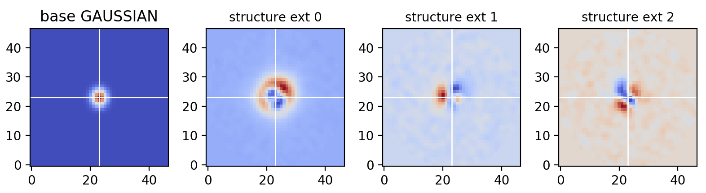

# ztfimg
ZTF Images tools 

# Installation

This package uses `sep` for source extraction, background estimation and aperture photometry. [sep](https://sep.readthedocs.io/en/v1.0.x/api/sep.extract.html) is a python version of sextractor.  

## Getting the PS1Calibrator files

Ask Mickael

# ztfimg

## Main Objects:
- `ScienceImage`: to load ZTF's `sciimg.fits` together with it's `mskimg.fits`)
- `ReferenceImage`: to load ZTF's `refimg.fits`
`ScienceImage` and `ReferenceImage` have the same methods and almost the same attributes. 

- `DAOPhotReader`: Simple Class to read the .psf doaphot outputs.

## usage

Say you have a sciimg and its associated mask:
```python
sciimg = "ztf_20200204197199_000812_zr_c04_o_q3_sciimg.fits"
mask = "ztf_20200204197199_000812_zr_c04_o_q3_mskimg.fits"
```
then:
```python
from ztfimg import image
z = image.ScienceImage(sciimg, mask)
z.load_source_background()
z.show()
```


This image is masked for bad pixels values (see bitmasking below) and background subtracted. The background is the sep.Background estimated on the bad-pixels and sources-masked out data.

## Conversions

- *counts, flux, mags*: You have all the `count_to_flux` or `mag_to_counts` ets combinations as methods.
- *(RA,Dec) vs. (x,y)*: use `z.coords_to_pixels(ra, dec)` or `z.pixels_to_coords(x,y)`


## Source Extraction 

You can run `sep.extract` to extract ellipses à la sextractor. Run:
```python
z.extract_sources(data="dataclean", setmag=True)
```

Access the results as:
```python
z.sources
```

## Masking

### source-masking

### ScienceImage: Bitmasking access
```python
# Here is the default masking, True, means datamasked=nan for these cases
z.get_mask( tracks=True, ghosts=True, spillage=True, spikes=True,
            dead=True, nan=True, saturated=True, brightstarhalo=True,
            lowresponsivity=True, highresponsivity=True, noisy=True,
            sexsources=False, psfsources=False)
```

## Aperture Photometry

you have the `get_aperture()` method that measure the exact aperture photometry given a (list of) position(s) and radius. You can also provide the annulus size if you want the aperture to be corrected for this as background.

For intance, you want the aperture photometry, in mag, on RA, Dec coordinates with 5 pixels radius:
```python
x,y = z.coords_to_pixels(RA, Dec)
mag, magerr = z.get_aperture(x,y, 5, unit="mag")
```

## Catalogs & Catalog Matching
Remark that both `sources`, `ps1cat` and any other catalog you set using the `set_catalog()` method are stored inside a `ztfimg.CatalogCollection` instance `z.catalogs`. This instance has all the matching functionalities between two catalogs you stored. 

For instance, you can also directly get matched values such as (x,y) ccd positions, (ra,dec) or mag beetwen `sources` and `ps1cat` by doing
```python
z.catalogs.get_matched_entries(["ra","dec","x","y","mag"], 'sources', 'ps1cat')
```
```
ps1cat_index	sources_index	angsep_arcsec	ps1cat_ra	sources_ra	ps1cat_dec	sources_dec	ps1cat_x	sources_x	ps1cat_y	sources_y	ps1cat_mag	sources_mag
0	0	200	0.177830	80.458424	80.458457	59.081236	59.081190	1524.971933	1524.929682	109.828648	109.999139	14.300	14.298286
1	1	439	0.091733	80.580818	80.580863	59.042257	59.042246	1315.658142	1315.579032	269.438577	269.482766	14.407	14.391963
2	2	2692	0.134097	80.643587	80.643647	58.627628	58.627608	1341.017199	1340.913537	1748.049916	1748.132412	14.422	14.414028
3	3	203	0.212481	80.378699	80.378784	59.076712	59.076673	1671.527068	1671.384957	111.507782	111.662257	14.432	14.426520
4	4	1222	0.195256	80.465035	80.465061	58.895667	58.895614	1577.243713	1577.213421	767.680720	767.871187	14.340	14.335927
5	5	2185	0.161587	79.866613	79.866664	58.679673	58.679636	2752.683959	2752.603432	1419.232736	1419.370579	14.317	14.305793
6	6	1496	0.072166	81.037901	81.037929	58.867203	58.867217	538.472196	538.415826	966.704057	966.660447	14.529	14.509354
```

## Get a Stamp

You can get a stamp of anywhere in the image, for instance center on a star matched both by `sources` and `ps1cat` as returned by `z.catalogs.get_matched_entries(["x","y"], 'sources', 'ps1cat')`. Once you have the `(x,y)` coordinates, do:
```python 
stamp = z.get_stamp(x,y, dx=23, dy=23)
stamp.show()
```
The stamp is centered on the pixel containing the given coordinates. The actual requested `(x,y)` is shown with the white cross.


You can also simply do:
```python
stampdata =  z.get_stamp(x,y, dx=23, dy=23, asarray=True)
```
to get the 2D numpy array rather than a `ztfimg.Stamp` object.


# DAOPhotReader

There is a simply class object that allows you to open the DAOPhot output data.
Given a  `sciimgdao.psf` file (aka. psffile) you have:
```python
from ztfimg import dao
d = dao.DAOPhotReader(psffile)
d.show()
```


The actual PSF is a combination of the base-profile (here "gaussian") and the structures. 
So to get the PSF made of 1 base-profile and 0.1 of each stamp:
```python
psf = d.get_psf(1, [0.1,0.1,0.1])
```

