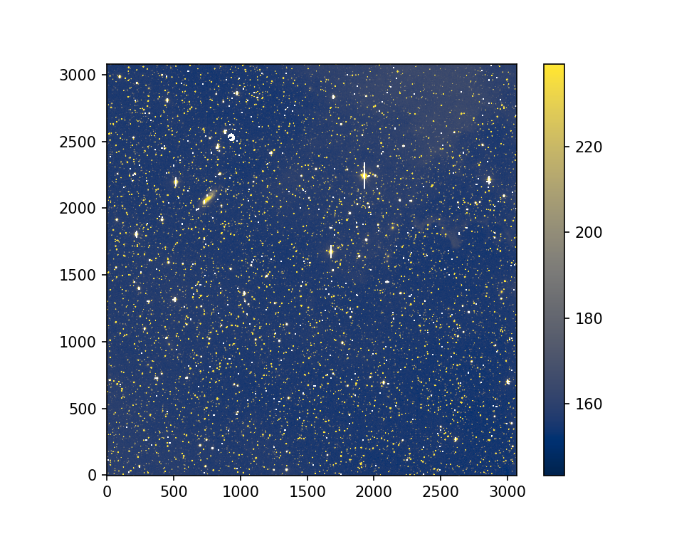

====================
ztfimg reference documentation
====================

ztfimg is a generic object-oriented API to enable to interact with
Zwicky Transient Facility (ZTF) images. The dask_ cluster computing
library is natively incorporated within the API such that one can use
numpy or dask.array as smoothly as doing `use_dask=True`. 

Objects
========

The ZTF camera (focalplane) is divided into 16 ccds themselves divided
into 4 quadrants. `ztfimg` enables you to interact with the data at
all levels and both for the raw data and the science images.

The data I/O is based on ztfquery_. It is strongly recommended (but
not mandatory) to have a running ztfquery_ environment.

Sharp start
============

.. toctree::
   :maxdepth: 2
   :caption: Sharp Start
	     
..  code-block:: python

    from ztfimg import io
    sciimg_path, maskimg_path = io.get_test_image() # load default images

    import ztfimg
    sci = ztfimg.ScienceQuadrant.from_filename(sciimg_path, maskimg_path)
    data = sci.get_data(apply_mask=True) # see also e.g. rm_bkgd
    fig = sci.show(data=data) # if data not provided, this will plot get_data()
    

Documentation
===============
    
.. toctree::
   :maxdepth: 2
   :caption: Getting Starting
	     
   notebooks/quickstart
   notebooks/ztfimgdask   
   notebooks/quadrant_ccd_focalplane
   notebooks/catalogs   
   notebooks/ztfimg_rawccd_rawquadrant

API
===============
    
.. toctree::
   :maxdepth: 3
   :caption: Package	      
  ztfimg

  
  
Indices and tables
==================

* :ref:`genindex`
* :ref:`modindex`
* :ref:`search`

.. _dask: https://www.dask.org/
.. _ztfquery: https://github.com/MickaelRigault/ztfquery/
